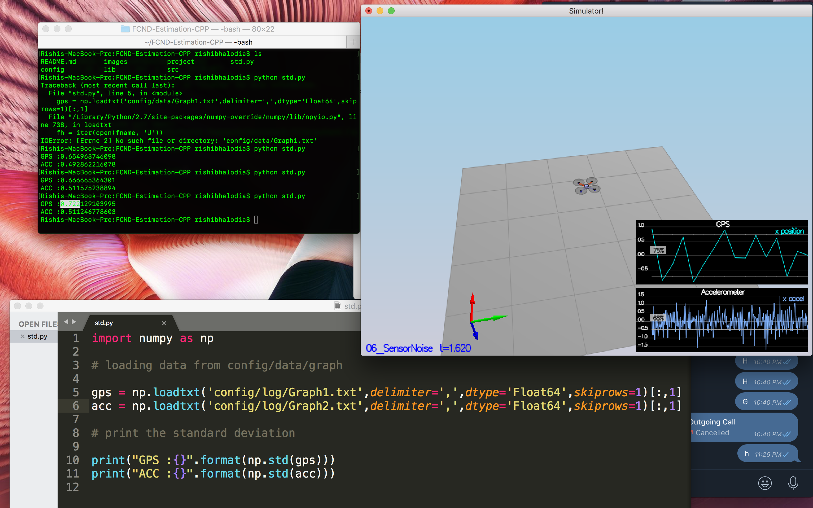
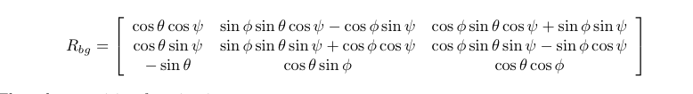
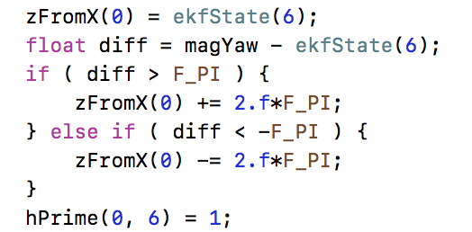

# Implement Estimator
## Determine the standard deviation of the measurement noise of both GPS X data and Accelerometer X data.

This was done using std.py where a data file Graph1.txt and Graph2.txt where load and then using numpy in python we had achieved our standard Deviation goal. 

This can be shown as below:

This was successfully passing all the criteria.

##Implement a better rate gyro attitude integration scheme in the UpdateFromIMU() function.

This step was achieved by using rotation matrix where phi and theta were values provided by roll Estimation and pitch Estimation. After that, we multiply the rotation matrix to gyro as given input parameter to get `phi_dot theta_dot psi_dot` and futher we Predict Roll and Pitch using intergation technique. 

The UpdateFromIMU in C++ is implemented in QuadEstimatorEKF.cpp starting from **line 98 to 121**.

## Implement all of the elements of the prediction step for the estimator.

PredictState() Function: In this case, We have input as currentState which is know as start state, dt also know as time step, accel input as acceleration and gyro. This will allow us to implement Prediction of the current state forward by time dt using current accelerations and body rates as input. This is done using this equation as follows:

GetRbgPrime() Function: We define the transition function in terms of the rotation matrix
Rbg which rotates from the body frame to the global frame. As described, there are 12 different
orders one could perform the rotation; we follow the convention from aerospace of using the 1,2,3 order for roll, pitch, and yaw.

This matrix is defined as follows:

Predict() Function: This will allow us to update the member variable cov to the predicted covariance(EKF_State) which can be achieved by intergation process. The formula we used can be given as follows:

## Implement the magnetometer update.

To implement the update, we need to use the equations from section 7.3.2 Magnetometer from the Estimation for Quadrotors paper. We assume we get a reading from the magnetometer reporting yaw in the global frame.This measurement may need to be computed using roll and pitch from the attitude filter and the mag vector.

This would update include the magnetometer data into the state.Angles are correctly measure and the angle error between the current state and the magnetometer value are verfied.

## Implement the GPS update.

This uses basic concept were we assume we get position and velocity from the GPS. We considered
using heading from the GPS, but this does not take into account the drone's orientation, only the direction of travel and this GPS measurement covariance is available in member variable R_GPS. It can be represented as follows as h and hPrime.

The UpdateFromGPS in C++ is implemented in QuadEstimatorEKF.cpp starting from **line 314 to 324**.

# Flight Evaluation

##Meet the performance criteria of each step.

Each and every step has been meeting its performacing criteria as each of them has been preformed in the Xcode Environment with proper specfic result for each function.

##De-tune your controller to successfully fly the final desired box trajectory with your estimator and realistic sensors.

Additional file of control project has been succefully added which yield out perfect flying trajectory in the environment. It has successfully meet the project preformance criteria without causing any kind of crashing or error in the project.
